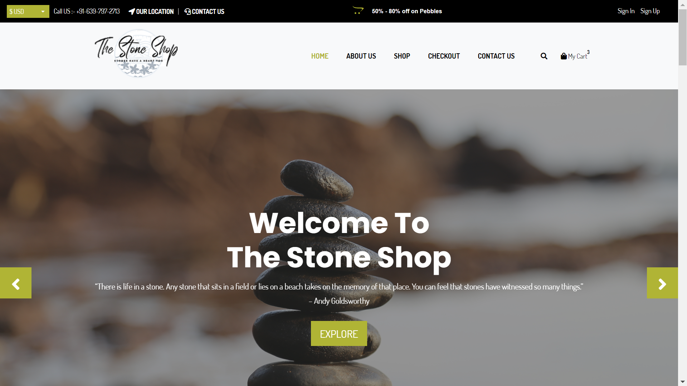
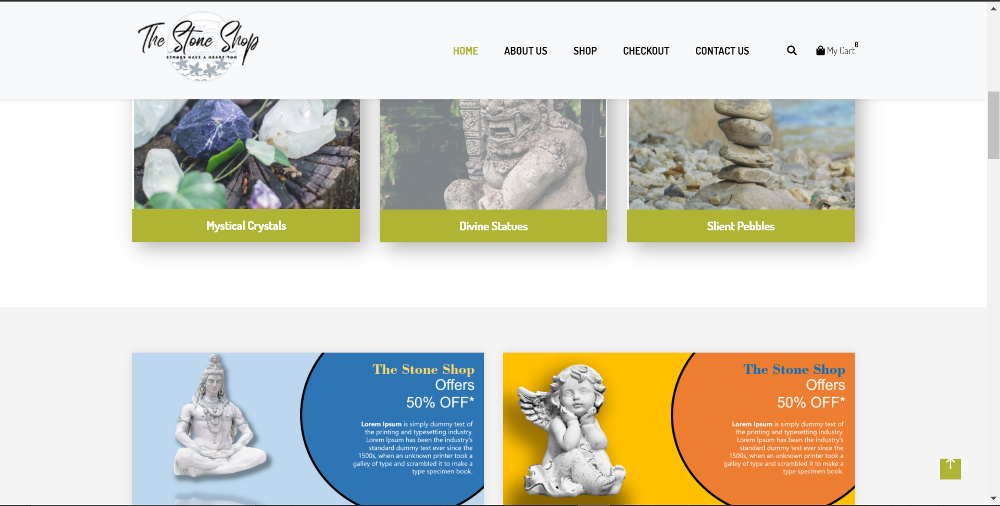
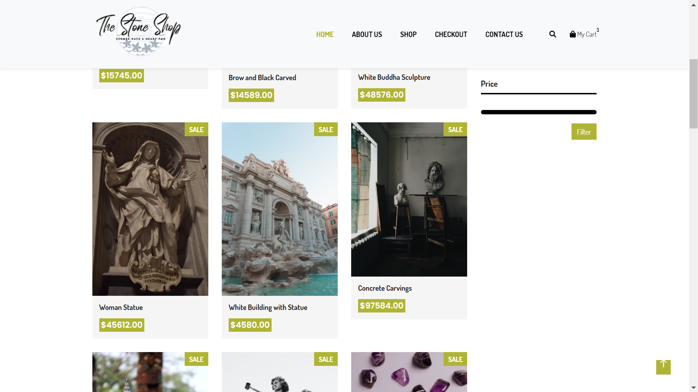
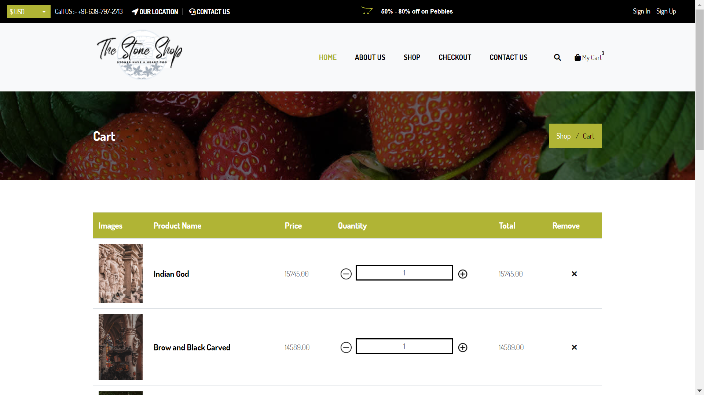
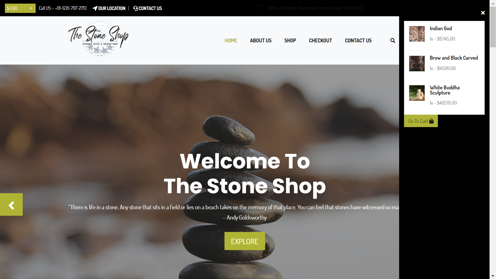
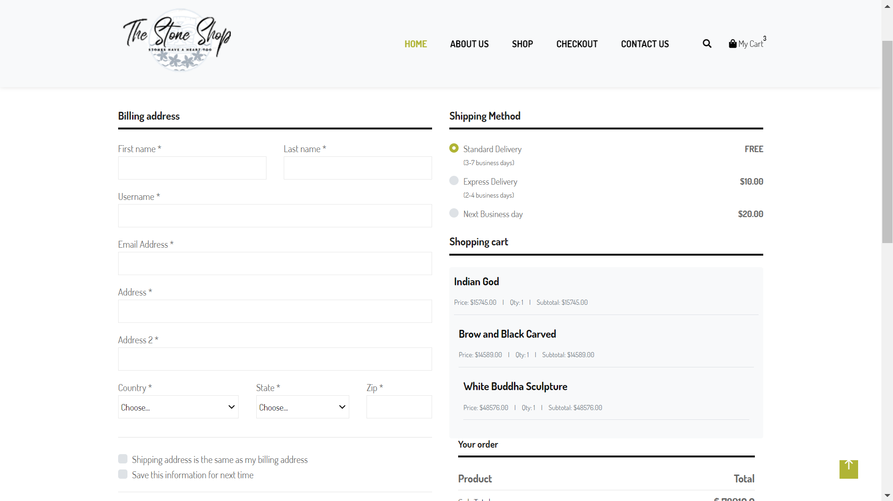

# The Stone Shop

<b>A Django Ecommerce web app to sell stone products.</b>

>The stone shop template comes with the following funtionalities:-
- Add Products with details such as image, name, price tags etc.

- A visitor can shop without creating an account but will need one to checkout.

- The shop currently support singler seller.

- Paypal Integration.

- Password Reset Functionality.

- Customer Registration.

> Used Cookies for Anonymous user interaction functionality.

Credits:- 
Images used are copyright freee, royalty free images from pexels.com and manyt other sources. The theme used was developed by TheWayShop.

## Enjoy Some ScreenShots
---

